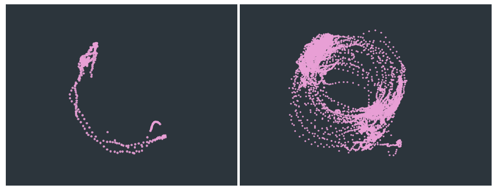
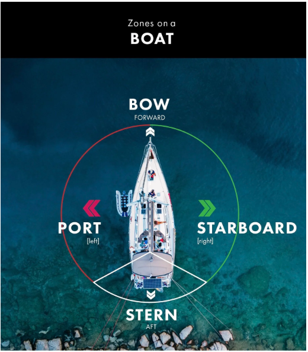
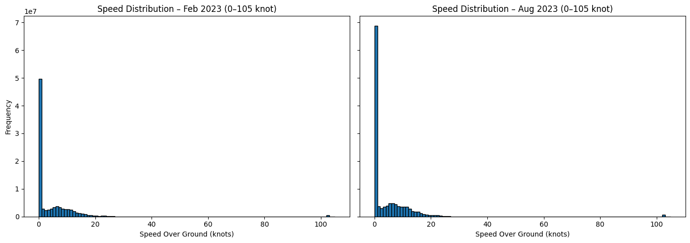
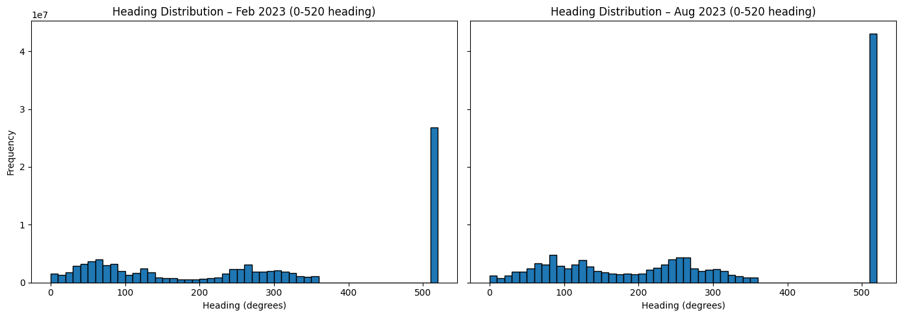
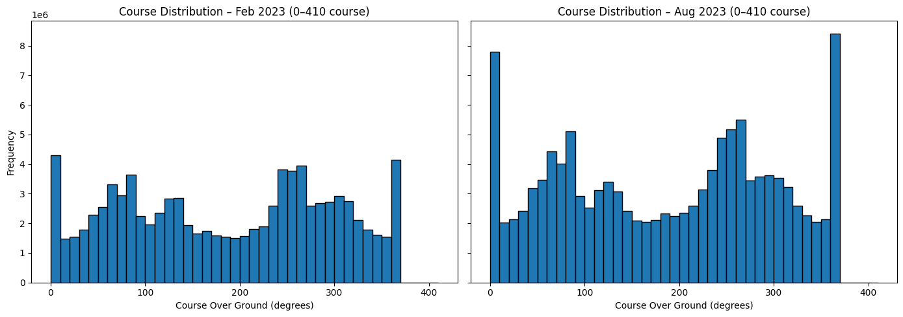
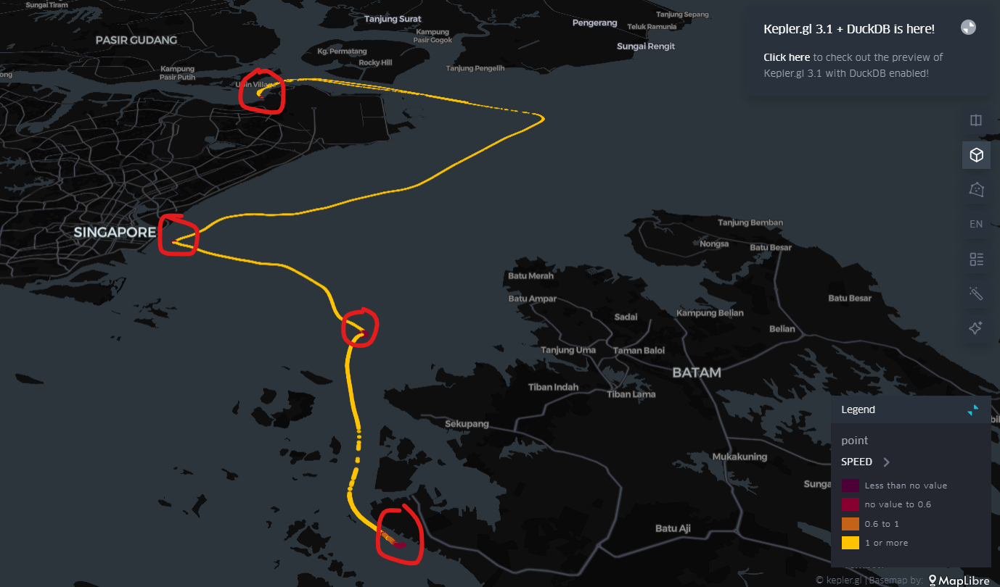
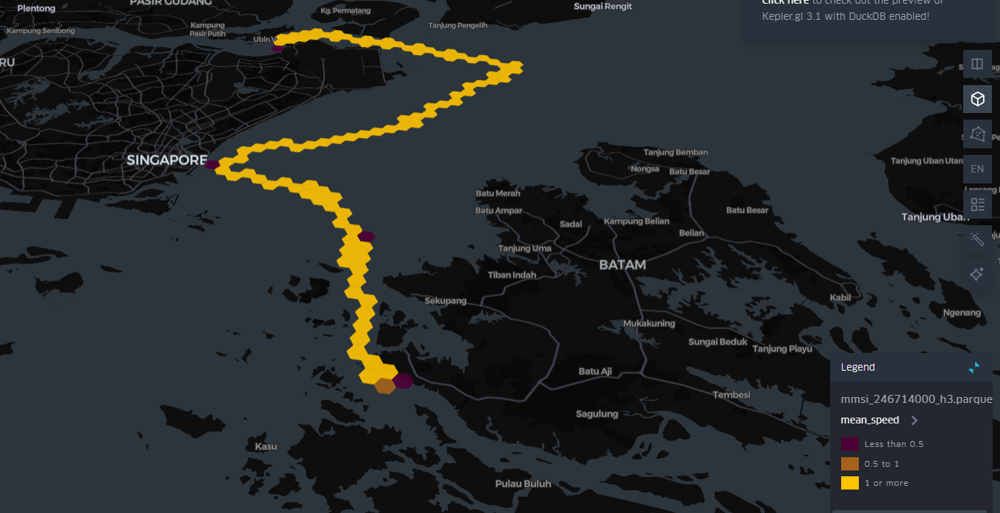
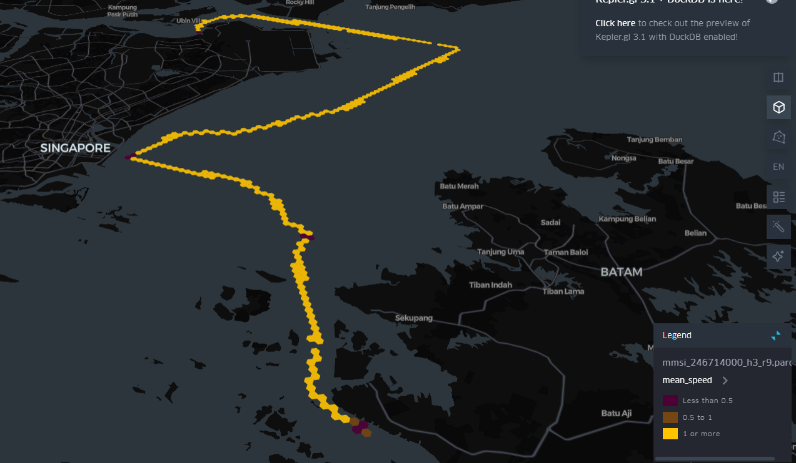
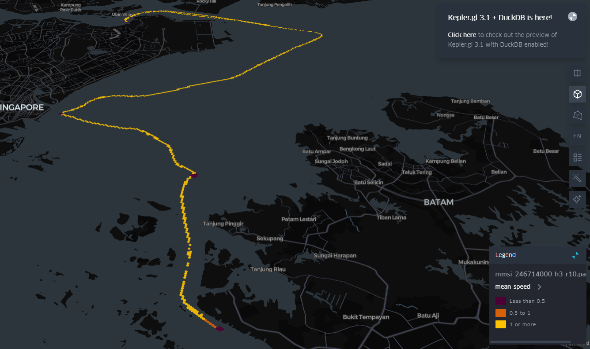

## Anchorage Detection & Segmentation
### Introduction
This project will work with `Automatic Identification System (AIS)` data to extract vessel mobility information. Probabilistic model will be developed to `detect` and `segment` anchorage event from AIS data. Also identifying when vessel is anchored, determining the start and end of each anchorage, distinguishing anchoring from other low-speed behaviour such as `berthing`, also improve the understanding of vessel mobility pattern like how ship move, stop, anchor, berth, drift, or change route over time, so it can be easier to analyze, and more predictable. In the meantime, also supporting the `quantification of navigational risk` and provide valuable input for downstream application such as `risk scorecard`, `maritime traffic analysis`, `port safety management`, etc.

`Anchoring` is one of the activities a vessel may undertake during its voyage. It is the maritime term which mean a vessel drop its anchor into the seabed to hold position offshore instead of moving. In AIS data analysis, `anchoring` is typically characterized by a `speed-over-ground (SOG)` between `0` and `1 knot`, usually at speed `<= 0.5 knot`. Depending on current tidal pattern, anchorage can occur `above 0.5 knot`. When the tidal current is `high/strong`, an anchored ship may still show `more than 0.5 knot`, can be affected by wind too. Another behaviour that should not be confused with anchoring is `berthing`. `Berthing` also occur at very low speeds `below 0.5 knot`, in the range of `0 to 0.2 knot`, unlike anchoring, it take place alongside a wharf or pier where the vessel is secured and does not swing or drift.

There are two type of anchorage, `Traditional SPOT Anchorage` and `Single Buoy Mooring (SBM)`/`Single Point Mooring (SPM)`.

`Traditional SPOT Anchorage`: This is when a vessel drop its anchor directly on the seabed at a chosen spot offshore. It can still swing or drift due to wind and current. Because the anchor may drag, the swing radius and shape of the vessel’s movement is often `irregular`.

`Single Buoy Mooring (SBM)/Single Point Mooring (SPM)`: It is when a vessel is moored to a fixed offshore buoy or structure. This keep the ship in place and allow it to rotate in a `regular` circular pattern.

Anchorage can take many shapes and sizes, such as `half-moon`, `full-moon`, or even `quarter-moon` pattern. The shape  depending on the anchorage duration and the tidal current pattern at an area. The lesser the anchorage duration, the lesser the likelihood of forming a full moon shape. However, in some area with calm sea, vessel may not form full-moon even when anchor for a long time, because there is little wind or current to move them around.

### Technology Used
1. `Duckdb` - Handle and query AIS data, AIS consist of million of record, and require fast processing.
2. `H3` - Convert AIS lat/lon into a hexagonal grid system so vessel movement pattern can be analyzed and visualized more effectively.
3. `Kepler` - Geospatial data visualization tool.
4. `Foursquare` (formerly `Unfolded.ai`) – A cloud-hosted, extended version of `Kepler.gl` with built-in `H3` support, collaboration, publishing, and scalable data handling. More suitable for larger dataset and heavy workload compared to the standalone open-source `Kepler.gl`.

### Dataset Understanding
1. `TIMESTAMP` - Exact time when the AIS message was received.
2. `MMSI` (Maritime Mobile Service Identity) - Unique nine-digit ID assigned to every vessel’s AIS transponder.
3. `LATITUDE`/`LONGITUDE` - Vessel’s position at the given timestamp.
4. `SPEED` (Speed Over Ground) - Vessel’s actual speed relative to Earth, in knot.
5. `HEADING` - The vessel’s compass direction, range from 0° – to 359°
6. `COURSE` (Course Over Ground) - The actual direction the ship is moving over the surface, range from 0° – 359°.
7. `SHIP_AND_CARGO_TYPE` - Vessel type (`70` → Cargo ship, `80` → Tanker, `90` → Other type, `0` → Not available / not classified, etc).
8. `TO_BOW` - Distance in meter from the AIS antenna to the bow (front) of the ship.
9. `TO_STERN` - Distance from the AIS antenna to the stern (back) of the ship.
10. `TO_PORT` - Distance from the AIS antenna to the port side (left side).
11. `TO_STARBOARD` - Distance from the AIS antenna to the starboard side (right side).

`HEADING` vs `COURSE` 
`HEADING`: The direction the bow of the ship is pointing, excluding external force (wind, tide, current, etc). 
`COURSE`: The direction the ship is actually moving across Earth’s surface, including external force, also identified as `real track`.

Illustration showing direction on a ship: `Bow (front)`, `Stern (back)`, `Port (left side)`, and `Starboard (right side)`. The value `TO_BOW,` `TO_STERN`, `TO_PORT`, `TO_STARBOARD` are just offset measurement, how far that single antenna is from each side of the ship. With those 4 number, can calculate the ship’s total length and width. 

### Step-by-Step
1. Data Conversion
    - For faster querying, the raw `csv` will be converted into `parquet` format. Refer to `convert_csv_to_parquet.ipynb`.
    - Data is saved into `feb_ais`, `aug_ais`, and `static_mmsi` table inside `ais.duckdb`.
    - Combined table `ais` (Feb + Aug) - Optional.
2. Data Analytics
    - February
        - `TIMESTAMP` count = `~106M`, but `LATITUDE/LONGITUDE` only `~90M` → `~16M` rows are missing. 
        - `SPEED`, `HEADING`, `COURSE` count = `90,430,360`, `~15.8` million rows are missing.
    - August
        - `TIMESTAMP` count = `~159M`, but `LATITUDE/LONGITUDE` only `~125M` → `~33M` rows are missing.
        - `SPEED`, `HEADING`, `COURSE` count = `125,210,300`, `~33.6` million rows are missing.
    - `MMSI` min = 0 → invalid
        - `MMSI` alway has `9-digit` positive integer.
    - `TO_BOW`, `TO_STERN`, `TO_PORT`, `TO_STARBOARD` min = 0 → likely missing dimension value
        - Probably mean the vessel has not reported its size or the AIS unit wasn’t configured properly.
        - Possible for very small boat (tug, fishing vessel, etc) to have tiny value.
    - `SPEED`, `HEADING`, `COURSE` → 0
        - `SPEED`: Likely valid (anchored/stopped), not missing.
        - `HEADING`: Bow pointing to north, can be real or no heading sensor.
        - `COURSE`: Moving exactly to north, valid, rare, uncommon.

- Both `February` and `August` show massive spike around `0–1 knot`.
- Outlier found at `102 knot` on the far right, probably caused by an AIS transmission error rather or common error.

Majority of AIS ship speed fall below `30 knot`.
1. `0–1 knot` → anchored or drifting.
2. `1–5 knot` → maneuvering near port.
3. `10–20 knot` → normal cruising speed.

- Big spike at `511°`, identified as outlier, which mean also `no heading information available`.
- Ship can only point `0–359°`.
- `February` and `August` both show similar pattern, but `August` has larger number of `511°`.

- Valid range should be `0–359°`, but both `February` and `August` extend up to `409°`.
- Values `>360°` is outlier, probably caused by bad AIS transmission.
- Both `February` and `August` show a similar overall pattern. However, `August` has more data volume, result in sharper spike and more pronounced distribution peak in the histogram.

3. Visualization
    - Refer to `split_by_mmsi.ipynb`.
    - Threshold Rule (SOG)
        - `Berthing`: `≤ 0.20`.
        - `Anchorage`/`Drifting`: `0.20` – `≤ 1.00`, (allowing drift, tide, wind, etc).
        - `Maneuvering`: `> 1` – `≤ 5`.
        - `Transit (slow underway)`: `> 5` – `≤ 10`.
        - `Cruising`: `> 10` – `≤ 20`.
        - `High-speed`: `> 20`.
    - Dwell Time (minimum duration per event)
        - `Berthing`: ≥ 15 min.
        - `Anchorage`: ≥ 30 min.
    - Displacement Check
        - `Berthing`: float within 100m.
        - `Anchorage`: swing within 300 – 600m.

    
    - Sample MMSI `246714000` extracted from `feb_ais`, chosen because it has the highest number of row, to enable clearer visualization in `kepler.gl`.
    - From the visualization, the ship is travelling from `Singapore (Pulau Ubin area)` to `Batam Island (Indonesia)` across the `Singapore Strait`.
    - For better anchorage recognition, threshold set at `0 - 0.6`, `0.6 - 1`, `> 1`.
    - The red dot in the image indicate potential anchorage location `SOG < 0.6`.
    - Missing `LATITUDE` & `LONGITUDE` values while ship is travelling.
        - Signal loss.
        - Transmission error.
        - Equipment issue.
    - Finding
        - Detect missing value in `LATITUDE`, `LONGITUDE`, `SPEED`, `HEADING`, and `COURSE`, even though `MMSI` and `TIMESTAMP` are present in those row.
        - `kepler.gl` misidentifying `MMSI` as a timestamp, a prefix `mmsi-***` is added to the `MMSI` field, so can filtering desired vessel.
        - The `static_mmsi` data does not support anchorage detection, as it lack movement, speed, or course information. However, it is useful for providing ship dimension and type.
        - Question raised
            - Will gap in voyage continuity lead to performance degradation in anchorage detection and segmentation model?
            - What is the `step`/ `solution` to fill the missing gap to help restoring voyage continuity?
            - There is no single `golden rule` to determine `anchorage`, `berthing`, or similar states. Detection depend on a combination of factor such as `speed threshold`, `dwell time`, `course change`, `location context` like port or anchorage zones, etc. Additional information from can support https://gpsd.gitlab.io/gpsd/AIVDM.html#_types_1_2_and_3_position_report_class_a this process.

4. `H3` Application
    - Refer to `h3_conversion`.
    - Use hexagon to aggregate AIS point into spatial bin.
    - Choose suitable resolution.
        - `res8` = `0.75 km²/hex` → `Start here`.
        - `res9` = `0.11 km²/hex`.
        - `res10` = `0.015 km²/hex`.
    - Finding
        - Res 8 = Voyage View → Show overall vessel movement and route pattern.
        - Res 9 = Anchorage View → Highlight vessel cluster in anchorage zone.
        - Res 10 = Berth View → Provide fine detail for berthing analysis.
    - Loading hex-aggregated data into `kepler.gl` is noticeably faster compared to loading the full raw AIS dataset. Hex bin reduce the number of point and simplify visualization.

Hex Resolution – 8

Hex Resolution – 9

Hex Resolution – 10

5. Model Training
    - Data Preprocessing
        - Remove `outlier`.
        - Drop row with missing value in `LATITUDE`, `LONGITUDE`, `SPEED`, `HEADING`, and `COURSE`.
        - Exclude record with `MMSI = 0`.
        - `berthing`, `anchoring`, etc flagging.

### Reference
1. Technical documentation explaining how to decode and interpret AIS message transmitted by ship: https://gpsd.gitlab.io/gpsd/AIVDM.html#_types_1_2_and_3_position_report_class_a