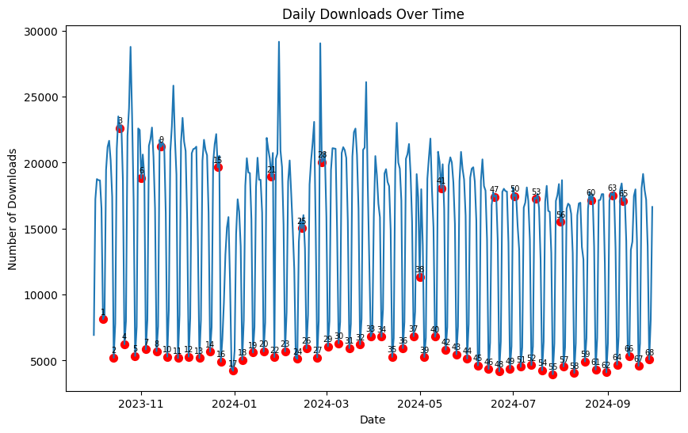
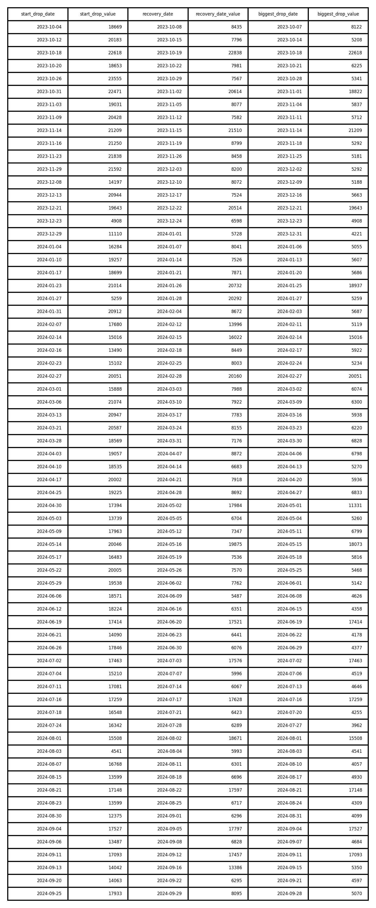
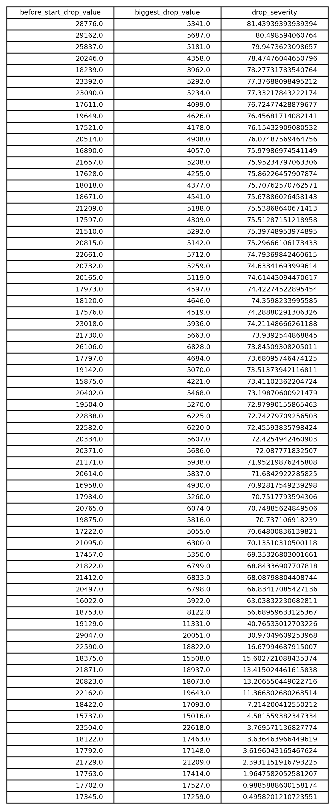

### <ins>Question 1</ins>
The CEO of a stock photo company is having the impression that there is a big drop in content downloads recently. Perform an analysis using downloads data here to better understand the situation.

Questions and contexts:
- When did the drop occur, if any do you think the CEO was referring to? How can we identify the drop? How serious is the drop?
      1. Overall Drop
    
     2. Overall Drop Table
    
     3. Percentage drop calculation 
    Formula: Percentage drop = ((Before Start Drop Value−Biggest Drop Value)/Before Start Drop Value)*100 
    ​

- Is the drop attributed to certain countries and/or users? If so, how can we identify them?
- Is the drop coming from many small downloaders, or coming from few major downloaders?
- Is the drop coming from the Malaysia market and a result of Malaysian public holidays because the CEO said he saw a drop in download count whenever there is a public holiday.
- What other insights can you obtain from this analysis?

Perform your analysis using Python and provide the code for the solution in a jupyter notebook. The fields 'uid' and 'supplier' from downloads table (downloads.csv) correspond to the 'uid' in the member table (member.csv).

### <ins>Question 2</ins>
Figure 1 and Figure 2 are two screenshots from the details page of a footage.