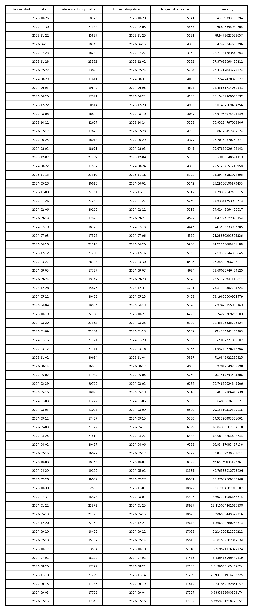

### <ins>Question 1</ins>
The CEO of a stock photo company is having the impression that there is a big drop in content downloads recently. Perform an analysis using downloads data here to better understand the situation.

Questions and contexts:
- When did the drop occur, if any do you think the CEO was referring to? How can we identify the drop? How serious is the drop?
      1. Overall Drop
    
     2. Overall Drop Table
    
     3. Percentage drop calculation 
    Formula: Percentage drop = ((Before Start Drop Value−Biggest Drop Value)/Before Start Drop Value)*100 
    ​

- Is the drop attributed to certain countries and/or users? If so, how can we identify them?
      1. Drop accociate with countries
    

        
         
    

    

        
         
    

    

        
         
    

    

        
         
    

    

        
         
    

- Is the drop coming from many small downloaders, or coming from few major downloaders?
    

        
    

    By using the 80th percentile of total downloads, which helps us identify the top downloaders contributing to the most significant share of total downloads. From the chart, major downloaders contribute to significant percentage of the total downloads, hence the drop is coming primarily from a few major downloaders. This suggests that the drop is likely due to a reduction in activity from a few key users (major downloader).
      
    

        
    

    Based on the result of cumulative percentage of downloads, the result indicates that the top 10% of downloaders contribute only 9.95% of the total downloads. This suggests that the majority of downloads are distributed among users beyond the top 10%. There are more significant contributors in the middle of the distribution or spread across a larger group than just the top 10%.
      

- Is the drop coming from the Malaysia market and a result of Malaysian public holidays because the CEO said he saw a drop in download count whenever there is a public holiday.
    

        
    

    According to the results, public holidays account for only 1.7% of the total downloads, making it unlikely that the observed drop is due to public holidays.
      

- What other insights can you obtain from this analysis?
     Seasonality of downloads insight
    

        
    

    Identify if downloads follow seasonal patterns, such as higher activity during certain months or specific times of the year. Observe if there are consistent peaks and valleys across years.
    
     Fraud detection insights:
    Fraud column has only one unique value, there is no sufficient data represented in this column for useful insight.

     Churn rate insight
    

        
    

    A churn rate of 80.30% suggests that a significant portion of users are discontinuing their activity such asnot downloading content anymore. This is potential issues with user retention or the effectiveness of the platform in keeping users engaged.
      

Perform your analysis using Python and provide the code for the solution in a jupyter notebook. The fields 'uid' and 'supplier' from downloads table (downloads.csv) correspond to the 'uid' in the member table (member.csv).

### <ins>Question 2</ins>
Figure 1 and Figure 2 are two screenshots from the details page of a footage.

Figure 1

Figure 2

Instructions: 
- Write a simple web demo in Python using a large language model (LLM) or (vision-language model) VLM with Langchain (https://python.langchain.com/docs/introduction/) that takes in a video or a video URL that can predict the caption and keywords for a video.  

- Besides using an LLM or VLM, what other approaches are available?
1. Rule-Based Approaches
     First step (frame analysis) - Use computer vision for scene recognition, pre-trained object detection or classification models such as YOLO, Faster R-CNN, ResNet for identifying key objects in the video. Can also use classical computer vision techniques such as edge detection, optical flow etc.. to identify objects, actions, or events.
      Second step (event detection) - Detect changes in scenes using histograms, color clustering, or motion analysis. Identify actions using handcrafted features like spatiotemporal descriptors. For example, histogram of optical flow, motion boundary histograms.
      Third step (caption formation) - Combine detected objects, actions, and events into simple template-based captions. For example, "A person [action] [object] in [scene]."
      Forth step (Keyword Extraction): Extract nouns, verbs, and other key parts of speech from captions using rule-based parsers. For example, NLTK or SpaCy. If the caption is "A person is running in a park", extract keywords like "person," "running," "park.".

2. Audio-Based Approach
     Can extract meaningful information from audio tracks in the video. Firstly, use speech-to-text models such as Google Speech API, AWS Speech to Text, etc to transcribe speech in the video then apply audio classification models to detect background sounds, events (clapping, honking, footsteps..), or emotions (excitement, sadness..). Combine audio insights with visual data for better captions and keywords. If the audio indicates there are clapping and cheering during a scene of running, the combined output might be "A person running in a marathon with an excited crowd cheering."

3. Multi-Modal Approach
     Can combine traditional methods for text, visual, and audio data. For example, extract visual features using object detection or action recognition models. Then process audio using speech-to-text model or sound event detection. After that, merge visual and audio outputs to form coherent descriptions with NLP techniques such as N-grams, TF-IDF and Word Embeddings. Finally, use simple NLP techniques such as n-grams, word embeddings, etc to summarize extracted data.

### <ins>Question 3</ins>
Image outpainting is a generative AI technique used to extend the borders of an image beyond its original frame, filling in new, realistic or stylistically consistent details. The goal is to expand the visual scene in a way that complements the original image’s style, colors, and context. This can be useful for tasks such as enhancing photos, creating wider visuals for social media, and designing artwork with broader scenes.

At the company, we have an AI tool called AI Image Extender and we are trying to improve its performance using better models and image processing techniques.

Instructions:
 ● Check out the Github repo https://github.com/xinsir6/ControlNetPlus and build a simple web demo for image outpainting. Users should be able to upload an image, specify which direction to outpaint (left, right, top, bottom, or any combination of them), a prompt and the app should return the generated (outpainted) result.
 ● What do you think of the performance of this model? How can we improve it?
 ● Outpainting with AI models sometimes produces a color discrepancy issue between the masked areas (pixel values == 255) and unmasked areas (pixel values == 0); refer Fig. 3 and Fig. 4 below. Write a simple web demo using Python that takes in an image and the outpaint mask and outputs a processed image with less color discrepancy between the masked and unmasked areas.

