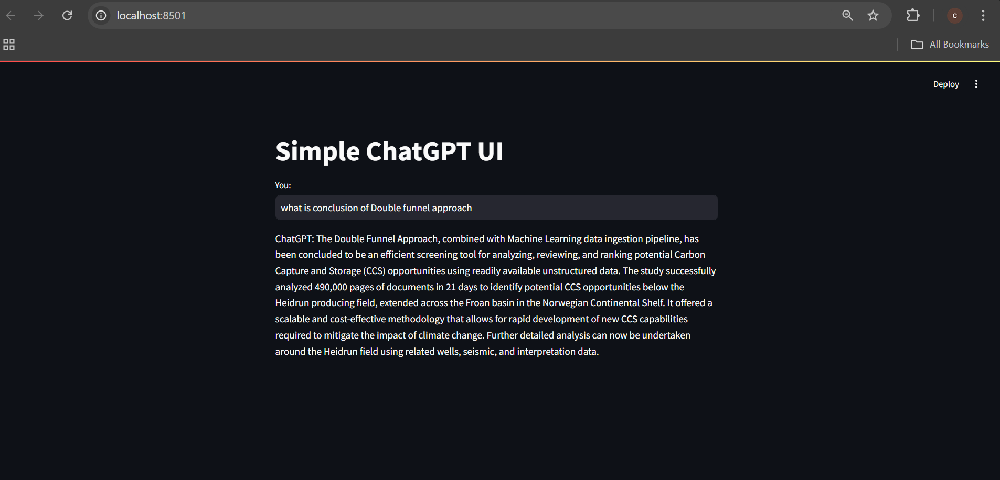

## Interview Test

<!-- ### Introduction -->

### Focus Area
1. Open `Azure Account Azure Free Trial` | `Microsoft Azure`. (This is free but will require a credit card account).
2. Perform `OCR Extraction` using `Tesseract`, use one `PDF Document` as input.
3. Create a `Docker` `Container` in `Azure` for `Tesseract`.
4. Extract text from the input data, and save in `Azure SQL` database.
5. Pull the extracted `OCR` text from `SQ`L database and use as input for chatbot.
6. Use a pre-trained large language model in `Hugging Face`, such as `OpenAI GPT` — `transformers 3.5.0 documentation (huggingface.co)`. Any `LLM` model may be used, ie `BERT`, `Llama`, `GPT Mistral` etc.
7. Use `Streamlit` to create a basic frontend for chatbot.
8. Explain the methods pros, cons and limitations.
9. Submit working frontend.

### Guidelines
1. To facilitate this exam, only 1 sample `PDF` input data will be used as input
2. `ChatGPT` may be used as guide for this exam, however, Applicant must disclose if/ when it was used
3. Applicant may still submit an alternative localhosted result for `Items 2 - 5`, if unable to open `Azure` account. `AWS` may also be used.

### Step By Step (Local)
1. Download `Tesseract OCR`
    - Visit [Tesseract OCR GitHub page](https://github.com/UB-Mannheim/tesseract/wiki).
    - Look for the Windows installer section and download the latest `.exe` file suitable for your system (32-bit or 64-bit).
    - Run the installer and follow the on-screen instructions to install `Tesseract OCR` on your system.
2. Locate the Installation Directory
    - By default, `Tesseract` will be installed in `C:\Program Files\Tesseract-OCR` or `C:\Program Files (x86)\Tesseract-OCR` for 32-bit systems.
3. Add `Tesseract` to the `System Environment Variables`
    - Copy the installation path `C:\Program Files\Tesseract-OCR`.
    - Open the `Environment Variables` settings.
    - Under `System Variables`, locate the `Path` variable and click `Edit`.
    - Add the `Tesseract` installation path as a new entry and click `OK` to save the changes.
4. Verify Installation
    - Open the `Command Prompt` (cmd).
    - Type `tesseract --version` and press `Enter`.
5. Install `pytesseract`
    - `pip install pytesseract`.
6. Install `poppler-windows`
    - Download `Poppler` from [here](https://github.com/oschwartz10612/poppler-windows).
    - Extract and transfer it to `C:\Program Files\` and add `C:\Program Files\poppler\bin` to the `Path` environment variable.

<!-- docker build -t tesseract-ocr-app .
docker run -p 8501:8501 tesseract-ocr-app
docker ps -a
docker exec -it name-of-container bash -->
        
<!-- streamlit run frontend.py -->

### Step By Step (Azure)
To be continued..

### Step By Step (AWS EC2)
1. Setup `AWS EC2` instance based on your budget and choose a `.pem` key file for secure remote access. Noted, can connect via `VS Code`.
2. Download `Docker` & `Ananconda` in `VM`.
    - Step 1: Download and install the `Anaconda` distribution of `Python`.
        ```
        wget https://repo.anaconda.com/archive/Anaconda3-2024.10-1-Linux-x86_64.sh
        bash Anaconda3-2024.10-1-Linux-x86_64.sh
        ```
    - Step 2: Update existing packages.
        ```
        sudo apt update
        ```
    - Step 3: Install `Docker` and `Docker Compose`.
        <br>Set up Docker's apt repository.
        <br>Follow the instructions here: [install-using-the-repository](https://docs.docker.com/engine/install/ubuntu/#install-using-the-repository).
        ```
        # Add Docker's official GPG key:
        sudo apt-get update
        sudo apt-get install ca-certificates curl
        sudo install -m 0755 -d /etc/apt/keyrings
        sudo curl -fsSL https://download.docker.com/linux/ubuntu/gpg -o /etc/apt/keyrings/docker.asc
        sudo chmod a+r /etc/apt/keyrings/docker.asc

        # Add the repository to Apt sources:
        echo \
        "deb [arch=$(dpkg --print-architecture) signed-by=/etc/apt/keyrings/docker.asc] https://download.docker.com/linux/ubuntu \
        $(. /etc/os-release && echo "$VERSION_CODENAME") stable" | \
        sudo tee /etc/apt/sources.list.d/docker.list > /dev/null
        sudo apt-get update
        ```
        Install the Docker packages.
        ```
        sudo apt-get install docker-ce docker-ce-cli containerd.io docker-buildx-plugin docker-compose-plugin
        ```
        To run docker without `sudo`:
        ```
        sudo groupadd docker
        sudo usermod -aG docker $USER
        ```
        Docker`s command
        ```
        docker images --all
        docker ps -a
        docker rmi test1:latest
        docker stop $(docker ps -q)
        docker rm $(docker ps -a -q)
        ```
3. Migrate `.env`, `2023-Double-Funnel.pdf`, `Dockerfile`, `ocr_extraction.py` & `frontend.py` to `VM`.
4. Create `AWS RDS`.
    - Select `PostgreSQL` as the database engine and enable `Public Access`.
    - Configure the `Security Group's Inbound Rules` to allow public accessibility. eg `Type: PostgreSQL`, `TCP: 5432`, `0.0.0.0/0.`
    - Create database `document_db`, then table
    ```
        CREATE TABLE extracted_text (
        id SERIAL PRIMARY KEY,
        page_number INT NOT NULL,
        text TEXT NOT NULL
    );
    ```
5. Run `Dockerfile`.
    ```
    docker build -t tesseract-ocr-app .
    docker run -p 8501:8501 tesseract-ocr-app
    ```
6. Result



### Step By Step (AWS Fargate)
To be continued..

### Purpose
1. Test applicant's ability to work in `Azure` environment, including working with `Virtual Machines`, generating `SQL` database an running a pipeline.
2. Test applicant's ability for integration of multiple libraries including structured and unstructured data focused on textual data.
3. Ability to communicate methodology and problem-solving skills.