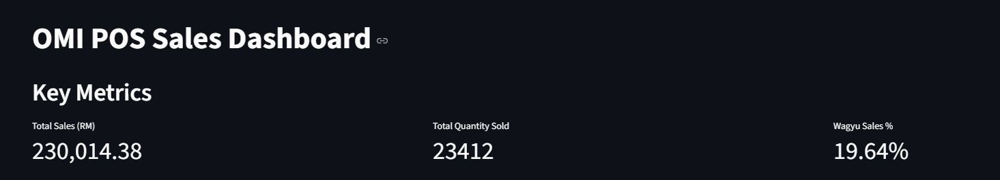
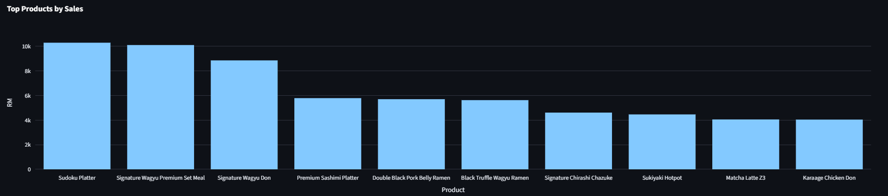
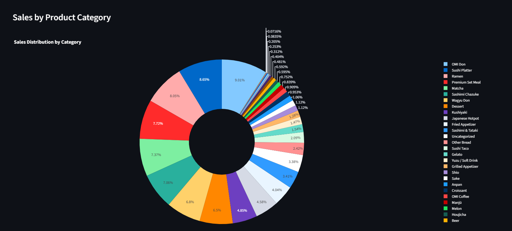
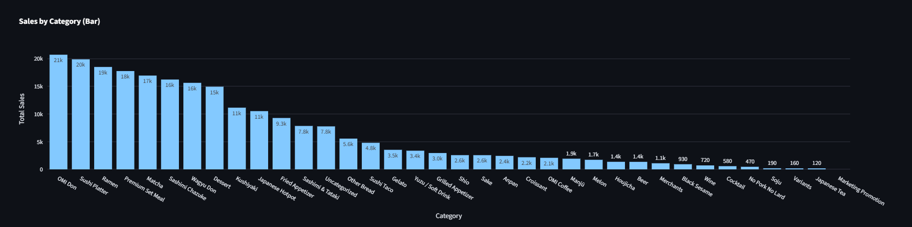

### POS Report Analysis - Part 1
What key metrics are chosen? 
- Total Sales (RM)
    -  Sum of all Total Sales values from the product list
- Total Quantity Sold
    - Sum of Total Quantity across all products
- Wagyu Sales Contribution (%)
    - Percentage of total revenue from Wagyu-related products
- Top 10 Products by Sales
    - Checking which products generating the highest revenue
- Sales by Category
    - Aggregated sales grouped by product category

Why These Metrics Matter to Business Decisions?
1. Total Sales & Quantity: Reveal overall business performance and demand volume
2. Wagyu Contribution: Checking the impact, marketing demand of premium products
3. Top Products by Sales: Help identify which items worth promoting or bundling
4. Category-Level Sales: Identify strong and weak product lines, help in guiding product mix, inventory, and R&D strategy

How layout supports clarity and insight?
1. Presents Total Sales, Quantity Sold, and Wagyu Contribution, allow faster decision-making process, and quickly assess performance


2. Highlights best-performing items by revenue. The combination of a table (precise values) and bar chart (visual ranking) helps identify what drives sales



3. Uses a pie chart (or bar chart) to summarize product line performance. This gives a clear picture of category-level contribution to overall sales.



To launch the interactive POS Sales Dashboard, run the following command in terminal
```
streamlit run pos-report-analysis.py
```

Product Contribution Analysis (Wagyu Sales %)<br>
Wagyu items contribute approximately 19.64% of total sales.
```
# Wagyu-related item sales / Total sales × 100
wagyu_mask = df["Product"].str.contains("wagyu", case=False, na=False)
wagyu_sales = df.loc[wagyu_mask, "Total Sales"].sum()
wagyu_pct = (wagyu_sales / total_sales * 100) if total_sales > 0 else 0
```

Sales Performance Metric<br>
It is best to track item performance based on `Sales Amount` rather than `Quantity Sold`
- Sales amount reflects actual revenue and financial impact
- Quantity can be misleading if high-volume items are low-priced

Product Development Recommendation
1. Sudoku Platter
    - RM10,294.2 in sales from 258 orders. This indicates high customer interest
2. Wagyu Karaage Don or Wagyu Sliders
    - Wagyu-based items (Don, Ramen, Set Meal) contribute ~39% of sales among top items
3. Matcha Dessert Series
    - highest quantity sold (410 units), showing strong matcha demand

Menu Strategy Framework
| Category                    | Strategy                                               | Example                                        |
| --------------------------- | ------------------------------------------------------ | ---------------------------------------------- |
| **Low Sales, High Profit**  | Promote in meal bundles or premium sets                | Sukiyaki Hotpot                                |
| **High Sales, High Profit** | Retain, highlight as core offerings                    | Signature Wagyu Don, Premium Set Meal          |
| **High Sales, Low Profit**  | Explore bundling, minor price increase | Matcha Latte Z3                                |
| **Low Sales, Low Profit**   | Phase out or replace with trending items               | Swiss Roll, Gelato - Lavender, Full Cream Milk |

### POS Report Analysis - Part 2
1. What key metrics you chose? 