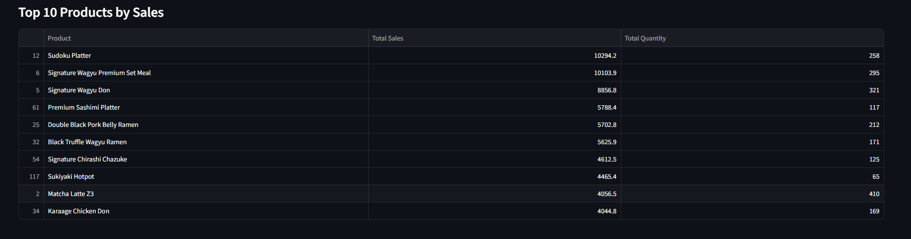
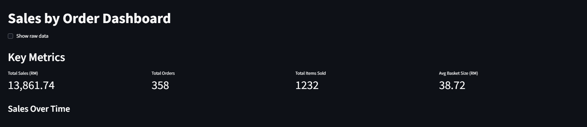
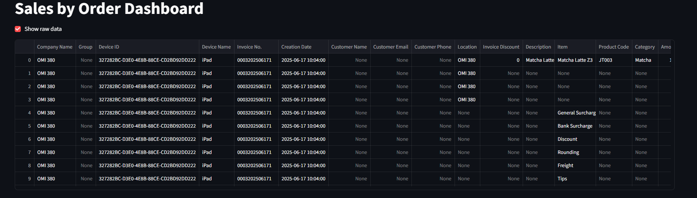
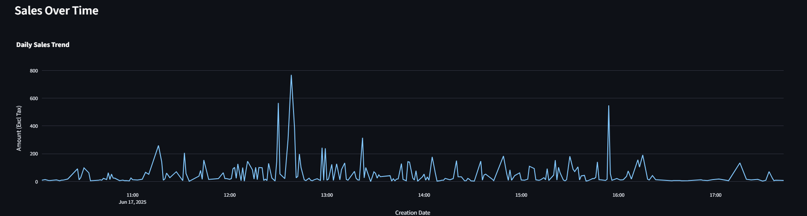
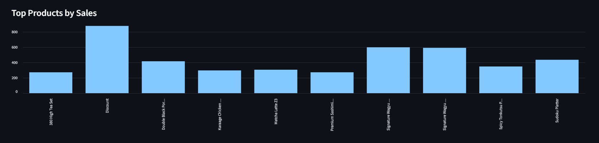
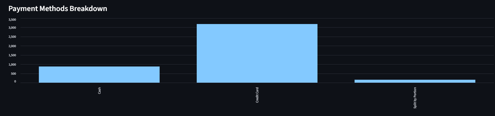
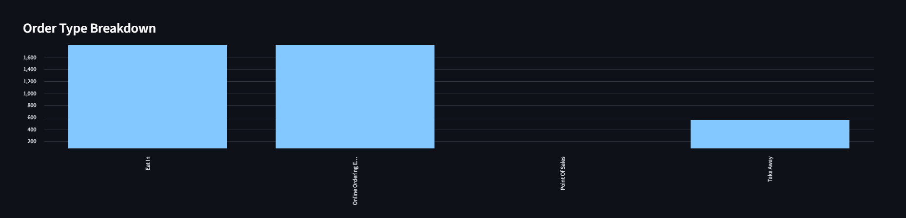

### POS Report Analysis - Part 1
What key metrics are chosen? 
- Total Sales (RM)
    -  Sum of all Total Sales values from the product list
- Total Quantity Sold
    - Sum of Total Quantity across all products
- Wagyu Sales Contribution (%)
    - Percentage of total revenue from Wagyu-related products
- Top 10 Products by Sales
    - Checking which products generating the highest revenue
- Sales by Category
    - Aggregated sales grouped by product category

Why These Metrics Matter to Business Decisions?
1. Total Sales & Quantity: Reveal overall business performance and demand volume
2. Wagyu Contribution: Checking the impact, marketing demand of premium products
3. Top Products by Sales: Help identify which items worth promoting or bundling
4. Category-Level Sales: Identify strong and weak product lines, help in guiding product mix, inventory, and R&D strategy

How layout supports clarity and insight?
1. Presents Total Sales, Quantity Sold, and Wagyu Contribution, allow faster decision-making process, and quickly assess performance


2. Highlights best-performing items by revenue. The combination of a table (precise values) and bar chart (visual ranking) helps identify what drives sales



3. Uses a pie chart (or bar chart) to summarize product line performance. This gives a clear picture of category-level contribution to overall sales.


To launch the the Dashboard, run the following command in terminal
```
streamlit run pos-report-analysis.py
```

Product Contribution Analysis (Wagyu Sales %)<br>
Wagyu items contribute approximately 19.64% of total sales.
```
# Wagyu-related item sales / Total sales × 100
wagyu_mask = df["Product"].str.contains("wagyu", case=False, na=False)
wagyu_sales = df.loc[wagyu_mask, "Total Sales"].sum()
wagyu_pct = (wagyu_sales / total_sales * 100) if total_sales > 0 else 0
```

Sales Performance Metric<br>
It is best to track item performance based on `Sales Amount` rather than `Quantity Sold`
- Sales amount reflects actual revenue and financial impact
- Quantity can be misleading if high-volume items are low-priced

Product Development Recommendation
1. Sudoku Platter
    - RM10,294.2 in sales from 258 orders. This indicates high customer interest
2. Wagyu Karaage Don or Wagyu Sliders
    - Wagyu-based items (Don, Ramen, Set Meal) contribute ~39% of sales among top items
3. Matcha Dessert Series
    - highest quantity sold (410 units), showing strong matcha demand

Menu Strategy Framework
| Category                    | Strategy                                               | Example                                        |
| --------------------------- | ------------------------------------------------------ | ---------------------------------------------- |
| **Low Sales, High Profit**  | Promote in meal bundles or premium sets                | Sukiyaki Hotpot                                |
| **High Sales, High Profit** | Retain, highlight as core offerings                    | Signature Wagyu Don, Premium Set Meal          |
| **High Sales, Low Profit**  | Explore bundling, minor price increase | Matcha Latte Z3                                |
| **Low Sales, Low Profit**   | Phase out or replace with trending items               | Swiss Roll, Gelato - Lavender, Full Cream Milk |

### POS Report Analysis - Part 2
What key metrics are chosen?
1. Total Sales (RM): Sum of all item-level sales excluding tax (Amount (Excl Tax))
2. Total Orders: Count of unique invoice numbers
3. Total Quantity Sold: Sum of item quantities sold
4. Average Basket Size (RM): Total sales divided by total orders
5. Sales Over Time: Daily sales trend based on Creation Date
6. Top Products by Sales: Highest-grossing items by total revenue
7. Sales by Category: Aggregated sales across different product categories
8. Payment Method Breakdown: Cash vs eWallet vs Credit Card usage
9. Order Type Distribution: Take Away vs Dine In performance

Why These Metrics Matter to Business Decisions
1. Revenue Tracking: Total sales, basket size, and quantity help assess financial performance
2. Product Strategy: Identifying top-selling items for marketing, bundling, and RnD.
3. Customer Behavior: Payment types and order methods highlight consumer preferences and tech adoption.
4. Trend Spotting: Daily sales trends help detect seasonality or promotions impact

How layout supports clarity and insight?
1. Total Sales, Orders, and Average Basket Size are displayed at the top for quick performance assessment. Raw data toggle allows further exploration.


2. A daily trend line shows revenue fluctuations and seasonality, spot sales spikes, dips, or patterns.

3. Aggregates sales at the category level to identify which product lines drive revenue.

4. Shows customer payment preferences (e.g., eWallet, cash), supporting decisions on payment options and POS optimization.

5. Distinguishes between Dine In and Take Away, helping with operational planning, staffing, and outlet strategy.


To launch the the Dashboard, run the following command in terminal
```
streamlit run sales_by_order_dashboard.py
```