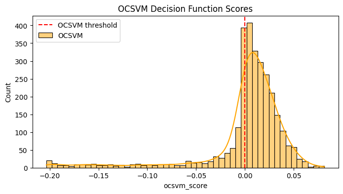

### Wafer - Anomaly Detection

#### 1. Introduction
This project is focused to identify anomalies in semiconductor wafer manufacturing data. Anomalies in wafer fabrication can lead to significant production issues, affecting yield and cost. By leveraging machine learning techniques, this project aims to detect such anomalies early in the process, ensuring quality control and minimizing waste.

#### 2. Dataset Insight
Process & Time Information
   - `timestamp` – Date and time of the wafer run
   - `run_start_time` - Local time when the run started (HH:MM:SS format)
   - `run` - Run number identifier for the wafer process instance

Equipment Identification
   - `tool_name` – Name/code of the equipment used
   - `tool_id` – Numeric or coded identifier for the tool
   -  `eqp_type` - Type/category of the equipment

Data Quality & Annotation
   - `data_quality` – Quality score for the run`s collected data
   -  `has_comments` – Indicator (0/1) if operator comments are attached

Lot & Recipe Detail
   - `lot_id` – Identifier for the wafer lot (batch)
   - `logical_recipe_id` – ID for the logical process recipe
   - `machine_recipe_id` – ID for the recipe as executed on the machine
   - `physical_recipe_id` – ID for the physical recipe file used
   - `recipe_id` – General recipe identifier
   - `lot_purpose_type` – Purpose of the lot
   - `lot_type` – Type of lot

Manufacturing Flow
   - `port_id` – Port on the tool where wafers are loaded
   - `process_op_num` – Process operation number in the route
   - `product_grp_id` – Product group ID
   - `product_id` – Product identifier
   - `route_id` – Route or flow ID for the manufacturing process
   - `technology` – Technology type

Wafer & Reticle
   - `wafer_id` – Unique identifier for each wafer
   - `reticle_id` – Identifier for the reticle (mask) used in lithography

Sensor Measurement
   - `tool_sensor_1` – `tool_sensor_52` – Numeric sensor readings collected during the run (temperature, pressure, flow rates, etc)

Event Information
   - `event_type` – Type of event
   - `event_name` – Name of the event
   - `event_id` – Event identifier
   - `event_source` – Source that generated the event
   - `event_description` – Description of the event

Alarm Information
   - `alarm_code` – Code for any alarm triggered
   - `alarm_status` – Status of the alarm

Process Calculation
   - `calc_step_seq` – Calculated process step sequence
   - `calc_loop_seq` – Calculated loop sequence number
   - `run_tag` – Tag for the run

Unused Column
   - `unnamed_85` – `unnamed_89` – Empty column with no data

#### 3. Data Preprocessing
 - Rename column step
   - All column will be renamed to readable, descriptive names to improve clarity during analysis
 - Handling missing value
   - Columns with 14,844 missing entries (completely empty) will be eliminated as provide no information
      - Target column: `reticle_id`, `event_source`, `event_description`, `alarm_code`, `alarm_status`, `tool_sensor_47` – `tool_sensor_52`, `run_tag`, and `unnamed_85` – `unnamed_89`
      - Action taken: Removed
   - High Missingness
      - `event_type`, `event_name`, `event_id` contain 14,388 null
         - `event_type`: EndOfRun, EndOfStart
         - `event_name`, `event_id`: WaferStart, WaferEnd
      - Action taken: Removed
   - Partial Missing Value
      - `tool_sensor_1` – `tool_sensor_46` have 456 missing value
      - `tool_sensor_42` has 228 missing value
      - `calc_step_seq` & `calc_loop_seq` also have 228 missing value
      - Action taken: Remove row with remaining null to get a clean dataset of 14,388 row because have sufficient dataset
- Constant feature handling
   - Column containing only a single value will be eliminated as it do not provide useful information for analysis
   - Target column: `tool_name`, `tool_id`, `eqp_type`, `has_comments`, `logical_recipe_id`, `lot_purpose_type`, `lot_type`, `tool_sensor_2`, `tool_sensor_3`, `tool_sensor_4`, `tool_sensor_22`, `tool_sensor_27`, `tool_sensor_28`, `tool_sensor_29`, `tool_sensor_30`, `tool_sensor_31`, `tool_sensor_32`, `tool_sensor_33`, `tool_sensor_41`, `tool_sensor_46`

#### 4. Exploratory Data Analysis
4.1 Time Series Analytics (Tool Sensor) 
To visualize sensor datas, showing fluctuations, trends, and unusual deviations in readings. Anomalies appear as abrupt spikes, drops, or persistent shifts from normal operating ranges. This view allows quick identification of which sensors exhibit abnormal patterns, the timing of these events, etc. 

4.2 Categorical Variable Analysis 
The frequency distribution plots show how values are distributed for each categorical feature. These charts highlight dominant categories, rare occurrences, and potential imbalances in the dataset. Can help identify whether categorical features are well-represented or skewed. Also to have insight on influence anomaly detection performance and model bias.

4.3 Relation Between Run, Run Start Time (Second) and Data Quality 
Time-series plots of these highlight trends, timing shifts, and quality drops that may indicate process anomalies. There exists a positive correlation among `run`, `run_start_time`, and `data_quality`. As the `run` number increases, both `run_start_time` and `data_quality` show an upward trend. For analytical purposes, `run_start_time` is converted into seconds and represented in a new column `run_start_time_second`.

#### 5. Feature Engineering
- Drop irrelevant feature
   - `timestamp`, `run`, `run_start_time`, `run_start_time_second`
   - All of them hold no useful for anomaly detection
- Data transformation (Encoding categorical column)
   - Given the high number of features, one hot encoding is impractical
   - Label encoding is used for converting categorical data into a numerical format
- Data transformation (Normalize numberical column)
   - Use `StandardScaler` to normalize values to mean = 0 and standard deviation = 1
   - `StandardScaler` over `MinMaxScaler`: Keep anomalies more visible, less squashing from outliers
   - Target column: `data_quality`, `tool_sensor_*` related
   - `wafer_id`, `calc_step_seq`, `calc_loop_seq` are excluded from normalization

#### 6. Feature Selection
Pairwise correlation matrix (Pearson/Spearman) was computed to identify redundant variables for feature selection in anomaly detection. The highest correlations were
- Perfect correlation (r = ±1.000): `machine_recipe_id`–`physical_recipe_id`, `calc_step_seq`–`calc_loop_seq`.
- Near-perfect correlation (r ≥ 0.99): `tool_sensor_34`–`tool_sensor_44`, `tool_sensor_15`–`tool_sensor_16`, `tool_sensor_26`–`tool_sensor_44`, `tool_sensor_26`–`tool_sensor_34`.
- Strong correlations (0.95 ≤ r < 0.99): `recipe_id`–`tool_sensor_14`, `lot_id`–`tool_sensor_34`, `product_grp_id`–`product_id`.

For anomaly detection, highly correlated variables can be redundant, the features will be dropped.

#### 7. Hyperparameter Tuning (Isolation Forest & One-Class SVM)
Performed hyperparameter tuning using ParameterGrid for Isolation Forest and One-Class SVM.
- Isolation Forest best params: `{'bootstrap': True, 'contamination': 0.01, 'max_features': 1.0, 'max_samples': 0.5, 'n_estimators': 200}`.
- OneClassSVM best params: `{'gamma': np.float64(0.001), 'nu': 0.01}`.

#### 8. Model Training & Model Prediction
Trained two anomaly detection models on an 80/20 train-test split:

- Isolation Forest (`bootstrap=True`, `contamination=0.01`, `max_features=1.0`, `max_samples=0.5`, `n_estimators=200`).
- One-Class SVM (`kernel='rbf'`, `nu=0.02`, `gamma=0.1`).

Both models output binary anomaly flags (`1` = anomaly, `0` = normal) for train and test sets.

#### 9. Anomaly Detection
- Anomaly Rates: Calculated percentage of anomalies flagged by each model on the test set.
   - OCSVM anomaly rate: 26.86%
   - IF anomaly rate : 0.94%
- Anomaly Scores:
   - OCSVM → decision_function scores
   - Isolation Forest → score_samples values
   - Sorted to identify top 20 most anomalous runs.
- Visualizations: Histograms of anomaly scores with decision thresholds marked.

 Majority of scores are positive (normal), with a small negative tail marking anomalies.

 Majority of scores are above the threshold (normal), with a left-tail of low scores indicating anomalies.
- Consensus Anomalies: Flagged runs where both models agree (`1 = anomaly`).
   - 24 runs flagged by both OCSVM and Isolation Forest.
- Inspection: Displayed top anomalous runs for further analysis.
   - Both models flag extremes in `tool_sensor_12`, `tool_sensor_15`, `tool_sensor_21`, `tool_sensor_23`, and `tool_sensor_38`. OCSVM focuses on sharp spikes, while Isolation Forest also captures deep negative dips and broader distribution shifts.

#### 10. Model Explainability
SHAP will be used identify which features most influence anomaly scores globally and explains, for each sample, how specific sensor values push it toward normal or anomalous.

For Isolation Forest `Global feature importance`, the SHAP plot shows that `tool_sensor_43`, `tool_sensor_1`, and `machine_recipe_id` have the highest impact on anomaly detection, with color indicating whether high or low values push predictions toward normal or anomalous.

For Isolation Forest `Local explanation`, most top features pushed this sample toward anomalous, with `tool_sensor_5` having the largest negative impact, while `tool_sensor_11` slightly offset this toward normal.

